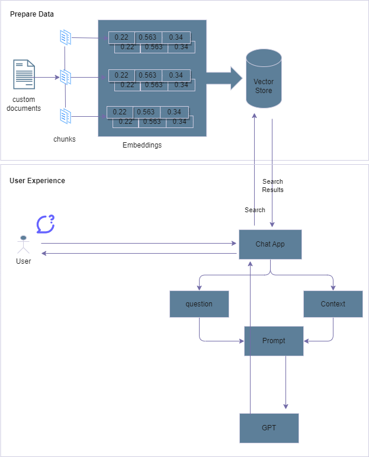
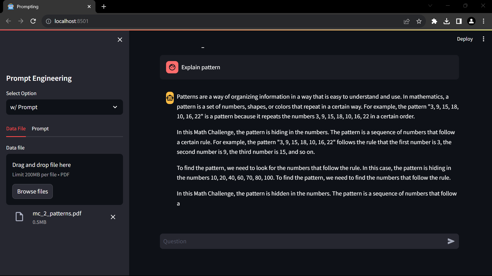

# GPT On Custom Knowledge  
This application helps to build a Chat GPT on internal document. It is build over RAG (Retrieval Augmented Generation) pattern.

## Overview
This app take a .pdf file and splits into chunk, encode and store into a vector storage.
It has two section
1. Prepare Data
2. User Experience

### Prepare Data
Custom PDF files/documents are converted into vectors and stored in a database. This example utilizes chroma db.

### User Experience
This part is a user interface with a chat window. The application first searches vector storage to find related content, and the result is assigned to a 'context' to prepare a prompt.



This application has Three  parts.
1. A pdf file which is the source for LLM
2. Prompt 
3. Chat windows 

## Setup
### Create virtual environment.
```
python -m venv prmpenv
``` 

### Activate python virtual environment
Assumption, "prmpenv" is successfully created
``` 
C:\Users\mailtopk\PrompEngr> .\prmpenv\Scripts\Activate.ps1
```
### Install required lib
```
(prmpenv) C:>pip install -r c:\users\mailtopk\PrompEngr\requirements.txt
```

### Run application
Cd into parent dir
``` 
 (prmpenv) C:\mailtopk\Prompengr> streamlit run .\src\mail.py
```

### Main screen
Expected results



#### Improvements 
- [ ] Search results from the vector storage are not consistent for the same question.
- [ ] Chat history is not stored.
- [ ] The document splitter needs improvement.
- [ ] Improve database storage.
- [ ] Results are truncated.
- [ ] Code refactor.